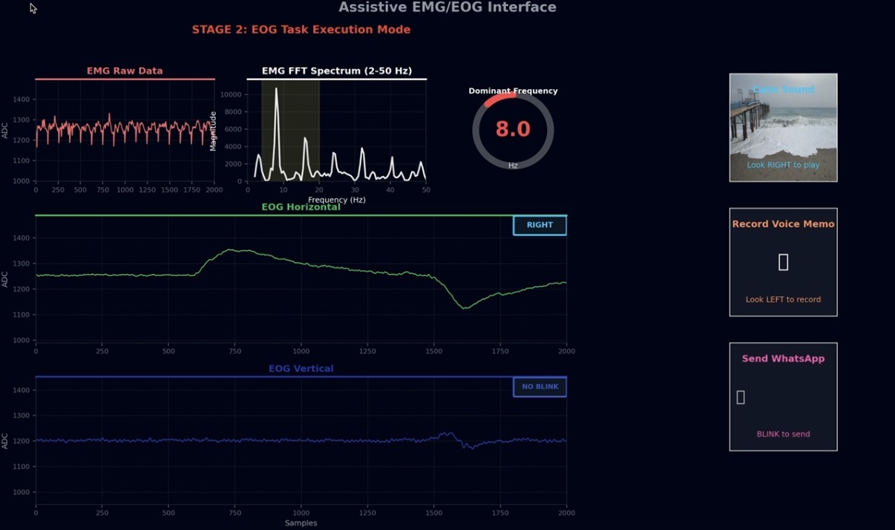

# EMG-EOG Interface: Tremor Detection & Assistive Control

Dual-channel biosignal acquisition system combining EMG and EOG sensing to
detect tremor activity and enable eye-movement-based computer control.

## System Overview

[Analog EMG/EOG frontend] → [MSP430: ADC + UART] → [Python: signal processing, classification, GUI]

- **EMG path:** tremor-band frequency detection (4–20 Hz) via FFT
- **EOG path:** adaptive calibration → direction classification (LEFT/CENTER/RIGHT)
  with persistence + opposite-direction blocking, and blink detection
- **Output:** cursor control mapped to gaze direction, tremor-relief audio
  trigger, and caregiver alert on tremor onset

## System Diagram


## Live Visualization


## Hardware

- Custom BMDAQ PCB (hand-soldered) for EMG/EOG analog front-end
- MSP430 (12-bit ADC12, UART @ 115200 bps, 1 kHz sampling)

## Repository Structure

- `firmware/` — MSP430 C firmware (ADC sampling, UART packet streaming)
- `python/` — Real-time visualization, calibration, and classification GUI

## Setup

```bash
pip install -r requirements.txt
python python/eog_emg_visualizer.py
```

Update `SERIAL_PORT` in `eog_emg_visualizer.py` to match your device.

## Status

Work in progress — developed as part of an undergraduate biomedical
engineering research project.
